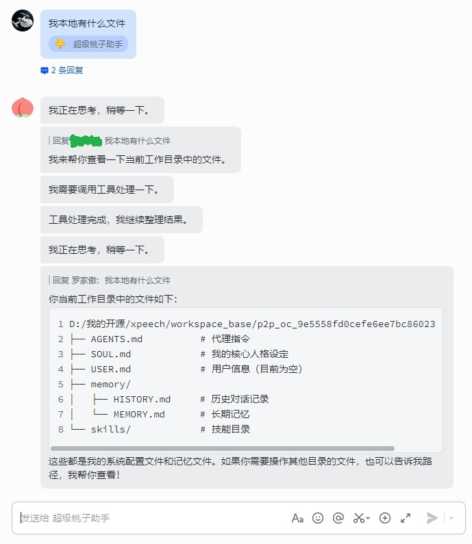

# Xpeech



Xpeech 是一个基于 FastAPI 的 Agent 服务。它提供一个 `/chat` 接口，可以接收文本、图片和文件，调用大模型生成流式回复，并在需要时调用工具完成任务。

适合用来快速启动一个可扩展的 AI Agent API 服务。

## 功能

- 提供 HTTP API 和 SSE 流式响应
- 支持文本、图片和文件输入
- 支持多轮会话和独立工作区
- 支持 LiteLLM 兼容的大模型服务
- 支持内置工具和自定义 Python 工具
- 支持飞书消息桥接
- 使用 `conf.toml` 管理普通配置，使用 `.env` 管理密钥

## 安装

需要 Python 3.12+ 和 uv。

```bash
uv sync
```

提前安装内置技能依赖：

```bash
npm install -g @playwright/cli@latest
npx playwright install chromium
```

## 配置

普通配置写在 `conf.toml`：

```toml
[path]
session_path = "session"
session_history_path = "session/history"
workspace_base_path = "workspace_base"

[llm]
api_base = "https://api.siliconflow.cn/v1"
default_model = "openai/Pro/moonshotai/Kimi-K2.6"
tools_python_package = "custom_tools"
default_tools = ["echo", "hello"]
support_image = true
support_video = true
support_json_output = true

[feishu]
app_id = "cli_xxx"
idle_timeout = 3
parallel = 3
```

密钥写在 `.env`：

```env
LLM__API_KEY=your_api_key_here
FEISHU__APP_SECRET=your_feishu_app_secret_here
```

`.env.example` 可以作为模板复制：

```bash
cp .env.example .env
```

## 启动

启动 API 服务：

```bash
uv run -m xpeech api
```

如果不指定服务，默认也是启动 API：

```bash
uv run -m xpeech
```

服务默认运行在：

```text
http://localhost:7878
```

启动后可以打开：

- Swagger UI: `http://localhost:7878/docs`
- ReDoc: `http://localhost:7878/redoc`

启动飞书桥接：

```bash
uv run -m xpeech feishu
```

飞书桥接会从配置中读取：

- `feishu.app_id`：飞书应用 ID
- `feishu.idle_timeout`：同一会话消息合并等待时间，单位秒
- `FEISHU__APP_SECRET`：飞书应用密钥，建议放在 `.env`

如需连接非默认 API 地址，可以传入 `/chat` 地址：

```bash
uv run -m xpeech feishu --chat-url http://127.0.0.1:7878/chat
```

## 发送消息

`/chat` 需要通过请求头传入会话 ID：

```bash
curl -N -X POST "http://localhost:7878/chat" \
  -H "x-session-id: demo-session" \
  -F 'session_metadata={"channel":"curl"}' \
  -F 'content=[{"text":"你好，介绍一下你自己"}]'
```

上传文件：

```bash
curl -N -X POST "http://localhost:7878/chat" \
  -H "x-session-id: demo-session" \
  -F 'session_metadata={"channel":"curl"}' \
  -F 'content=[{"text":"帮我看看这个文件"}]' \
  -F "files=@example.txt"
```

响应是 SSE 流，可以边生成边读取。

## 自定义工具

在 `conf.toml` 里指定工具包：

```toml
[llm]
tools_python_package = "custom_tools"
default_tools = ["echo", "hello"]
```

工具包示例：

```text
custom_tools/
  __init__.py
  test_tools.py
```

`custom_tools/__init__.py`：

```python
from .test_tools import echo, hello

__all__ = ["echo", "hello"]
```

`custom_tools/test_tools.py`：

```python
from typing import Annotated

from pydantic import BaseModel, Field


def hello():
    """Return a hello message."""
    return "hello"


class Message(BaseModel):
    content: Annotated[str, Field(description="The content to echo")]


def echo(message: Message):
    """Echo the message content."""
    return message.content
```

工具函数需要有 docstring。函数可以不接收参数，也可以接收一个 Pydantic `BaseModel` 参数。

## 目录

```text
conf.toml              # 普通配置
.env                   # 本地密钥，不建议提交
custom_tools/          # 自定义工具包
xpeech/                # 服务代码
workspace_base/        # 每个会话的工作区
session/history/       # 会话历史
```

## 开发

```bash
uv sync
uv run -m xpeech api
```

如果需要检查配置是否能读取：

```bash
uv run python -c "from xpeech.config.settings import settings; print(settings.model_dump())"
```

## TODO

- [ ] 添加 cron
- [ ] 添加心跳
- [ ] 添加飞书 CLI
