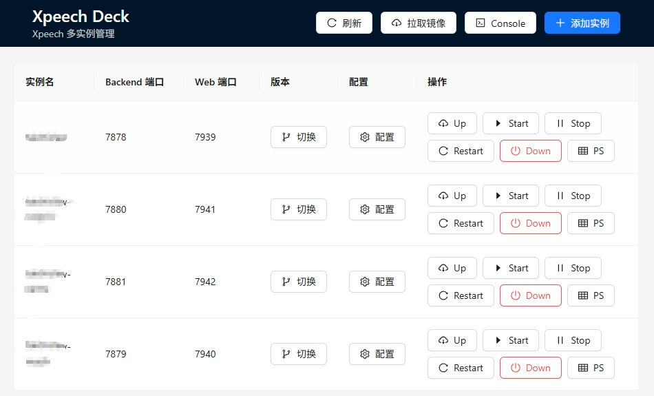
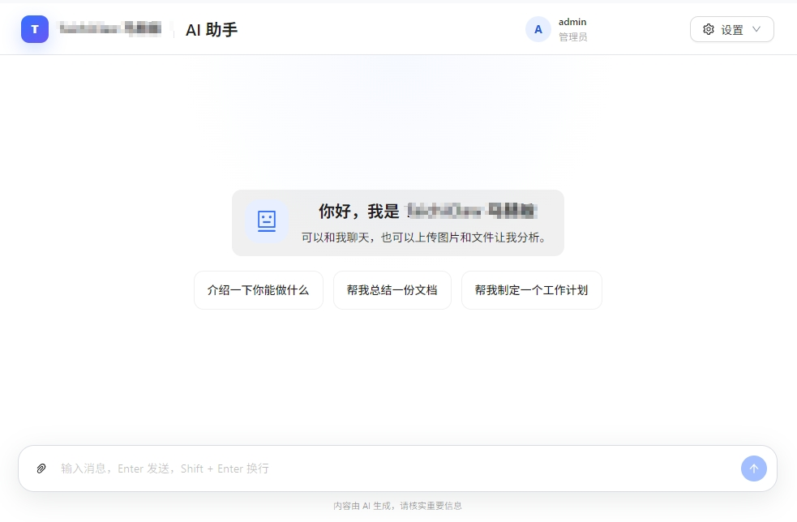

<p align="center">
  
</p>

<h1 align="center">Xpeech</h1>


Xpeech 是一个基于 FastAPI 的 Agent 服务。它提供一个 `/chat` 接口，可以接收文本、图片和文件，调用大模型生成流式回复，并在需要时调用工具完成任务。

适合用来快速启动一个可扩展的 AI Agent API 服务。

## 功能

- 提供 HTTP API 和 SSE 流式响应
- 支持文本、图片和文件输入
- 支持多轮会话和独立工作区
- 支持 LiteLLM 兼容的大模型服务
- 支持内置工具和自定义 Python 工具
- 支持通过 MCP Server 扩展 Agent 工具
- 支持飞书消息桥接
- 使用 `conf.toml` 统一管理应用配置和密钥
- YAML 格式存储会话历史，可读性更好
- 自动历史消息压缩（三级压缩策略），避免超出上下文限制
- 内置记忆系统，自动总结和保存关键信息
- 支持视频输入
- Token 使用率实时监控
- 丰富的内置工具集：文件读写、Shell 执行、Web 搜索与网页抓取、`agent-browser` 浏览器自动化、Office 文档读取、文件发送、向用户提问

## 安装

需要 Python 3.12+ 和 uv。项目依赖通过 `uv sync` 安装：

```bash
uv sync
```

Shell 工具只支持 Linux，并依赖 bubblewrap 沙盒。Debian/Ubuntu 可这样安装：

```bash
sudo apt-get install bubblewrap
```

提前安装内置技能依赖：

```bash
pip config set global.index-url https://pypi.tuna.tsinghua.edu.cn/simple

npm config set registry https://registry.npmmirror.com/
```

Docker 镜像已安装 `agent-browser`。Compose 通过 Browserless Chromium 容器提供 CDP 服务，Xpeech 不会在 backend 容器内安装、启动或管理本地浏览器。

## 配置

从模板创建本地配置：

```bash
cp conf.toml.example conf.toml
```

进程环境变量写在 `.env`，例如 PPT 导出脚本使用的远程 CDP 地址：

```env
CDP_URL=ws://browserless:3000
```

API 与各通道通过短期 JWT 认证。请在 `conf.toml` 中配置一个独立的共享密钥：

```bash
uv run python -c "import secrets; print(secrets.token_hex(32))"
```

```toml
[jwt]
secret_key = "replace-with-the-random-value-generated-above"
algorithm = "HS256"
access_token_expire_seconds = 60
```

`secret_key` 至少 32 个字符；访问令牌最长有效 60 秒。Compose 中的 backend、feishu
和 web_client 会读取同一份 `conf.toml`，无需分别配置。

## 启动

按需在独立终端启动各服务：

```bash
# API 服务
uv run -m xpeech api

# API 服务（省略服务名时的等价写法）
uv run -m xpeech

# Web 客户端（依赖 API 服务）
uv run -m xpeech web_client

# 飞书桥接（依赖 API 服务）
uv run -m xpeech feishu
```

默认访问地址：

- API：`http://localhost:7878`
- Web 客户端：`http://localhost:7939`
- Swagger UI：`http://localhost:7878/docs`
- ReDoc：`http://localhost:7878/redoc`

Swagger UI、ReDoc 及 `/openapi.json` 可直接访问，不再使用原来的文档账号密码。在
Swagger UI 右上角点击 `Authorize`：`username` 可填写任意标识（例如 `docs`），
`password` 填写 `jwt.secret_key`。Swagger 会调用 `/token` 校验密钥并签发一个有效期
60 秒的 JWT，后续调试请求会自动携带该令牌。部署时必须使用 HTTPS，避免共享密钥在
传输过程中泄露。

飞书桥接会从配置中读取：

- `feishu.app_id`：飞书应用 ID
- `feishu.idle_timeout`：同一会话消息合并等待时间，单位秒
- `feishu.app_secret`：飞书应用密钥

Docker 镜像会从 `https://gitee.com/luojiaaoo/lark-cli` 的 `v1.0.89` 标签编译
wrapper 和独立的 `/usr/local/bin/lark-oauth`。`lark-cli` 只消费缓存中的用户令牌；
`lark-oauth` 复用该版本 lark-cli 内置的 Device Authorization Flow，并负责刷新令牌。
`app_id`、`app_secret` 属于构建时配置，修改后必须重新构建镜像。首次执行需要用户身份的命令时，
CLI 会调用 `lark-oauth`，输出设备授权 URL（以及可能出现的用户码）并退出；程序会把短期设备授权状态
`lark-cli-oauth-pending.json` 和令牌 `lark-cli-user-token.json` 保存到当前用户私有的
`workspace_base_path/<session-id>/home/.config/xpeech/` 中，不会写入公共 `sandbox_home_path`。
用户完成授权后重新执行原命令，`lark-oauth` 会轮询完成令牌申请；不需要 backend 回调，也不需要在
飞书应用中配置 CLI 回调地址。令牌后续到期时会使用飞书 OAuth v2 token 接口刷新。
refresh token 按单次轮换处理：只有 access token 已过期、现有授权范围仍满足请求且 refresh token
尚未过期时才会刷新；刷新成功必须取得并持久化新的 refresh token。明确失效、过期、撤销或已使用的
refresh token 会被丢弃并重新进入设备授权，网络错误、限流和服务端临时错误则保留现有状态供下次重试。
刷新前会验证私有缓存目录可写，刷新后的令牌使用原子替换、目录同步和有限次数重试落盘。运行时必须保证
同一会话内只有一个 `lark-oauth` 或可能触发它的 `lark-cli` 命令正在执行。

首次授权默认申请 `offline_access`、`contact:user.base:readonly` 和
`contact:user.employee:readonly`。需要增加权限时可单独执行 `lark-oauth`，`--scope` 可以重复，
也可以用逗号或空格一次传入多个 scope；已有令牌的 scope 会被保留：

```bash
lark-oauth --scope docs:doc:readonly --scope drive:drive:readonly
lark-oauth --scope "docs:doc:readonly,drive:drive:readonly"
```

再次运行 scope 集合相同的 `lark-oauth` 命令时，程序会使用已保存的 `device_code` 轮询，每次最多
等待 60 秒。第一次仍未授权时保留设备授权状态，允许再运行一次；第二次仍未授权时删除
`device_code` 文件并返回“用户未授权”，下一次运行将生成新的授权 URL。取得新令牌后再重跑原业务命令。

需要修改监听地址、端口或后端地址时，可通过对应命令的 `--help` 查看参数。

## 快速部署平台

如果需要通过可视化界面快速部署和集中管理一个或多个 Xpeech 实例，可以使用
[Xpeech Deck](https://github.com/luojiaaoo/xpeech-deck)。它会为每个实例维护独立的 Xpeech Git
工作树和 Docker Compose 环境，并提供：

- 创建 Xpeech 实例，自动更新并在远程分支、标签和近期提交之间切换版本
- 在线配置 Backend / Web Client 端口、`conf.toml` 和自定义内置技能
- 执行 Up、Start、Stop、Restart、Down 和 PS 等常用 Docker Compose 操作
- 检查和拉取 Xpeech 所需镜像，通过 System Console 查看命令及执行结果



Xpeech Deck 是自托管平台，需要与 Docker 和所有受管 Xpeech 实例运行在同一台机器上。
安装、配置和访问方式请参阅 [Xpeech Deck 使用说明](https://github.com/luojiaaoo/xpeech-deck#readme)。

## Docker Compose 部署

Compose 会启动四个容器：

- `browserless`：Browserless Chromium CDP 服务，仅限 Docker 内网访问
- `backend`：Xpeech API、Agent 和工具执行服务
- `feishu`：飞书长连接桥接服务，通过 Docker 内网访问后端
- `web_client`：Web 客户端及认证代理，默认暴露在 `http://localhost:7939`

先准备配置和环境变量：

```bash
cp conf.toml.example conf.toml
cp .env.example .env
```

填写 `conf.toml` 中的 `llm.api_key` 和 `feishu.app_secret`，并确认
`.env` 中的 `CDP_URL` 与容器网络一致，再确认
`conf.toml` 中的 `llm`、`feishu.app_id` 等普通配置正确，然后构建并启动：

```bash
docker compose up -d --build
```

后端默认暴露在 `http://localhost:7878`，Web 客户端默认暴露在
`http://localhost:7939`。可通过环境变量 `BACKEND_PORT` 和 `WEB_CLIENT_PORT` 修改端口；
lark-cli 使用设备授权流程，不依赖这两个端口：

```bash
BACKEND_PORT=8080 WEB_CLIENT_PORT=8081 docker compose up -d --build
```

查看运行状态和日志：

```bash
docker compose ps
docker compose logs -f browserless backend feishu web_client
```

持久化数据统一映射到宿主机
的 `./docker_data/` 目录，其中包含 `session`、`workspace_base` 和
`browser_preview`，Web 用户数据库保存在 `web_client/users.db`；缓存目录不做宿主机磁盘
映射。`conf.toml` 以只读方式挂载，`.env` 通过 `env_file` 注入进程。普通运行时配置修改后重建容器
即可生效；`feishu.app_id` 或 `feishu.app_secret` 修改后需要增加 `--build` 重新编译 lark-cli 和
lark-oauth：

```bash
docker compose up -d --force-recreate browserless backend feishu web_client

# lark-cli 构建配置发生变化时
docker compose up -d --build --force-recreate backend
```

## 发送消息

`/chat` 需要 Bearer JWT，并通过请求头传入会话 ID 和发送者用户名。JWT、会话 ID
和发送者用户名都是必填项；用户名包含非 ASCII 字符时，可以使用 UTF-8 URL 编码：

```bash
curl -N -X POST "http://localhost:7878/chat" \
  -H "Authorization: Bearer <JWT>" \
  -H "x-session-id: demo-session" \
  -H "x-sender-name: demo-user" \
  -F 'session_metadata={"channel":"curl"}' \
  -F 'content=[{"text":"你好，介绍一下你自己"}]'
```

上传文件：

```bash
curl -N -X POST "http://localhost:7878/chat" \
  -H "Authorization: Bearer <JWT>" \
  -H "x-session-id: demo-session" \
  -H "x-sender-name: demo-user" \
  -F 'session_metadata={"channel":"curl"}' \
  -F 'content=[{"text":"帮我看看这个文件"}]' \
  -F "files=@example.txt"
```

响应是 SSE 流，可以边生成边读取。

每次成功完成的普通对话都会通过 SQLModel 追加到统一的
`session_record_path` 数据库文件。SQLite 表名为 `conversation_records`，
包含 `session_id`、`sender_name`、`user_question`、`model_response`、`input_tokens`、
`output_tokens`、`model_call_count`、`created_at` 和 `duration_s` 九个业务字段，以及 ORM 使用的自增
`id`。`created_at` 是应用写入记录时的 UTC 时间，`duration_s` 是本轮 Agent 处理耗时（秒）。
`session_record_path` 默认是
`data/session/record.db`，可在 `conf.toml` 的 `[path]` 中覆盖。

## 统计接口

统计接口使用与 `/chat` 相同的 Bearer JWT，统一位于 `/statistics`：

- `GET /statistics`：问答量、活跃用户、会话数、模型调用次数、Token 和平均耗时总览。
- `GET /statistics/timeseries`：按 `hour`、`day`、`week` 或 `month` 返回使用趋势，默认使用
  `Asia/Shanghai` 时区分桶。
- `GET /statistics/users`：按问答次数倒序返回用户统计。
- `GET /statistics/sessions`：按最近活跃顺序返回会话统计。
- `GET /statistics/records/latest?limit=20`：按 ID 倒序返回最新完整问答，供滚动大屏使用。
- `GET /statistics/records?after_id=<id>`：按 ID 正序返回指定 ID 之后的完整问答，供大屏增量刷新使用。

统计时间筛选使用左闭右开区间：`start_at <= created_at < end_at`。列表接口支持 `limit` 和
`offset`，其中 `limit` 最大为 100。服务端会按完整查询参数缓存结果 5 秒，并合并相同参数的并发查询。
完整问答接口仍返回 `Cache-Control: no-store`，避免浏览器或代理持久缓存问答内容。

```bash
curl "http://localhost:7878/statistics/records/latest?limit=20" \
  -H "Authorization: Bearer <JWT>"
```

### 内置命令

在聊天中输入以下命令可以使用快捷功能：

- `/help` - 显示帮助信息
- `/new` - 开始一个新会话，自动总结并保存当前会话记忆

## 自定义工具

在 `conf.toml` 里指定工具包：

```toml
[llm]
tools_python_package = "custom_tools"
default_tools = ["echo", "hello"]
```

工具包示例：

```text
custom_tools/
  __init__.py
  test_tools.py
```

`custom_tools/__init__.py`：

```python
from .test_tools import echo, hello

__all__ = ["echo", "hello"]
```

`custom_tools/test_tools.py`：

```python
from typing import Annotated

from pydantic import BaseModel, Field

def hello():
    """Return a hello message."""
    return "hello"


class Message(BaseModel):
    content: Annotated[str, Field(description="The content to echo")]


def echo(message: Message):
    """Echo the message content."""
    return message.content

```

工具函数需要有 docstring。函数可以不接收参数，也可以接收一个 Pydantic `BaseModel` 参数。

## 浏览器自动化

浏览器自动化通过内置 `agent-browser` 技能完成。Compose 内的 backend 通过
`ws://browserless:3000` 连接 Browserless；browserless 不对外暴露端口，仅限容器内网访问。Agent 使用 Shell 执行
`agent-browser` 命令时，执行层会自动追加当前请求的 `--session` 和配置的
`--cdp` 参数。

模型在首次进行浏览器操作前会从工作区的
`skills/agent-browser/SKILL.md` 加载内置技能；该目录由沙盒以只读方式映射，并按其约束复用注入的
CDP 连接和 session。Xpeech 不提供本地浏览器回退；CDP 连接失败时会直接报错。

## MCP 工具

可以在 `conf.toml` 的 `[tool.mcpServers.<name>]` 下配置 MCP Server。启动会话时，Xpeech 会连接这些 Server、发现可用工具，并把它们注册为 Agent 默认工具。

stdio Server 示例：

```toml
[tool.mcpServers.filesystem]
command = "npx"
args = ["-y", "@modelcontextprotocol/server-filesystem", "."]
enabled_tools = ["*"]
tool_timeout = 30
```

远程 MCP Server 示例：

```toml
[tool.mcpServers.my-api]
url = "https://mcp.example.com/sse"
headers = { Authorization = "Bearer xxx" }
enabled_tools = ["search", "read_record"]
tool_timeout = 120
```

每个会话都会把当前用户 workspace 作为 MCP workspace root。stdio MCP
进程同时以该目录作为 `cwd`；HTTP/SSE MCP 通过标准 `roots/list` 获取同一目录。
因此 MCP、内置文件工具和 Shell 的相对路径基准保持一致。远程 MCP 服务若需
直接读写文件，必须能以相同绝对路径访问该目录。

普通搜索和网页文本抓取使用 `web_search` 和 `web_fetch`；需要浏览器渲染或
交互操作时使用 `agent-browser`。`browser_preview_base_url` 只负责生成
`agent-browser` 能访问的 URL 前缀，FastAPI 路由由该 URL 的 path 部分自动注册；
`browser_preview_path` 只负责存放预览文件，两者没有
路径推导关系。`create_browser_preview` 会把目录复制到 `<browser_preview_path>/<uuid>/`；
传入目录时返回该 UUID 目录的 URL 前缀；传入单个 HTML 时保留源文件名，
并返回完整的文件 URL。

字段说明：

- `command` / `args`：启动 stdio MCP Server 的命令和参数。
- `url`：连接远程 MCP Server。`/sse` 结尾的地址使用 SSE transport，其他地址默认使用 streamable HTTP。
- `env`：stdio Server 的环境变量。
- `headers`：远程 MCP Server 的请求头。
- `enabled_tools`：允许注册的 MCP 工具名，`["*"]` 表示全部注册。
- `tool_timeout`：单次 MCP 工具调用超时时间，单位秒。

`command` 和 `url` 只能二选一。MCP Server 配置会按原样传入，不会做运行时字符串替换。

注册后的工具名会加上 `mcp_<server>_` 前缀，例如 `filesystem` Server 暴露的 `read_file` 会注册为 `mcp_filesystem_read_file`。`enabled_tools` 可以填写 MCP 原始工具名，也可以填写加前缀后的工具名。

## 内置工具

Xpeech 提供丰富的内置工具，Agent 可以在对话中自动调用：

| 工具 | 说明 |
|------|------|
| `read_file` | 读取工作区或内置技能目录中的文件内容 |
| `write_file` | 向工作区写入文件 |
| `edit_file` | 编辑工作区内的文件 |
| `list_dir` | 列出工作区或内置技能目录内容 |
| `shell` | 执行 Bash 命令（带工作区路径限制和 bwrap 沙盒） |
| `web_fetch` | 抓取网页内容并转为 Markdown |
| `web_search` | 搜索网页并返回结果 |
| `create_browser_preview` | 将工作区内目录或单个 HTML 复制到 UUID 预览目录，返回目录 URL 前缀或完整文件 URL |
| `shell` + `agent-browser` | 通过注入的 CDP 连接搜索、打开、读取、检查和操作网页 |
| `read_office_file` | 读取 Office 文档（docx/xlsx/pdf/pptx 等） |
| `send_file` | 向用户发送工作区或内置技能目录中的文件 |
| `ask_user_question` | 向用户发送表单提问 |

工具文本结果超过 `[tool].max_result_chars`（默认 10,000）时不会丢弃尾部内容：完整结果会以
文本文件保存到当前会话 workspace 的 `tool-results/`，工具消息返回原始内容前缀、总字符数和
相对文件路径。该阈值统一用于 shell、MCP、内置工具和自定义工具。`read_file` 是例外：执行器不会
把它的结果再次保存到 `tool-results/`；它会在返回内容超过该阈值时直接拒绝读取并提示缩小范围，
避免读取超长结果文件时再次生成结果文件。

### 工具安全

- **统一路径解析**：文件工具、文件发送工具和 Shell 绝对路径检查统一通过 `xpeech/agent/tools/helper.py` 解析路径；默认限制在工作区内，读取类操作可额外访问内置技能目录，写入和编辑仍只能落在工作区内
- **预览目录隔离**：`create_browser_preview` 只能复制当前会话工作区内的目录或 HTML，每次写入 `<browser_preview_path>/<uuid>/`，请求子路径不能越出对应 UUID 目录
- **Shell 沙盒**：Shell 命令通过 bubblewrap 运行，工作区可读写，内置技能目录只读挂载，系统运行时路径只读挂载，临时目录和工作区父目录使用 tmpfs 隔离
- **依赖安装隔离**：Shell 工具首次使用时自动创建 `<workspace>/.venv`；项目 Python 依赖进入当前工作区虚拟环境，`uv tool install` 和 `npm install -g` 安装到 `<workspace>/home`，不会在会话间共享可写状态
- **Shell 黑名单**：禁止执行 `rm -rf`、`format`、`dd` 等危险命令
- **路径遍历检测**：拦截包含 `..` 的路径操作

### 沙盒

Shell 命令会在 bwrap 进程沙盒中执行：

- 每个会话工作区会绑定为可读写目录，并作为命令工作目录。
- 内置技能目录以只读方式挂载，便于读取技能脚本和资源。
- `/tmp` 和工作区父目录会使用临时文件系统隔离，避免命令看到其他工作区。
- `/usr`、`/bin`、`/lib`、证书和 DNS 配置等系统路径以只读方式挂载，提供基础运行环境。
- `HOME` 会指向当前会话的 `<workspace>/home`；路径参数中的 `~` 也会解析到这个目录。
- `PATH` 会优先包含当前 HOME 下的 `.local/bin` 和 `.npm-global/bin`，`uv tool install`、`npm install -g` 的命令只在当前会话持久化。
- `sandbox_home_path` 指定公共 HOME 配置源目录（默认为 `data/sandbox-home`）；其中的所有文件都会保留相对路径，通过 bwrap 只读映射到每个 HOME。

Shell 工具首次运行时会在工作区内执行 `uv venv .venv`，为该工作区创建独立 Python 环境。
Python 命令必须通过 `uv run python ...` 启动，直接执行 `python` / `pip` 会被安全检查拦截。
沙盒内设置了 `PIP_REQUIRE_VIRTUALENV=true` 和 `UV_PROJECT_ENVIRONMENT=<workspace>/.venv`，确保项目 Python 依赖安装进入当前工作区的 `.venv`。
同时设置 `UV_CACHE_DIR=<workspace>/home/.cache/uv` 和 `NPM_CONFIG_PREFIX=<workspace>/home/.npm-global`，让 uv 缓存、uv tool 工具和 npm 全局工具都保留在当前会话 HOME 内。

如果 `npx` 来自 nvm 或真实用户 HOME 中的 Node 安装，沙盒默认看不到它；需要把 Node/npm/npx 安装到 `/usr`、`/bin`、`/opt` 等沙盒可见路径，或在沙盒内通过可见的 npm 安装全局工具。

## 开发

```bash
uv sync
uv run pytest
```

如果需要检查配置是否能读取：

```bash
uv run python -c "from xpeech.config.settings import settings; print(settings.model_dump())"
```

## Web 客户端

Web 客户端基于 React 和 Ant Design X，使用 FastAPI 认证代理访问 Agent API，
并通过 SQLite 保存用户与登录会话。



登录后的管理员可从页面右上角的“设置”下拉框进入“数据大屏”，也可通过 `/api/statistics`、`/api/statistics/timeseries`、
`/api/statistics/users`、`/api/statistics/sessions` 和 `/api/statistics/records*` 查询统计数据。
Web 服务会签发短期后端 JWT，将请求及全部查询参数转发到后端对应的 `/statistics*` 接口。
普通用户不会显示大屏入口，直接访问统计代理也会返回 403。

首次运行前构建前端：

```bash
cd xpeech/channel/web_client/frontend
npm install
npm run build
```

用户与登录会话数据库路径由 `conf.toml` 的
`web_client.database_path` 配置，默认为 `data/web_client/users.db`。登录 Cookie 名称由
`web_client.cookie_name` 配置，默认为 `xpeech_session`；同一 IP 上运行多个独立 Web
实例时，应为每个实例配置不同的名称（如 `xpeech_session_7939`），避免不同端口之间覆盖 Cookie。

### OAuth2 登录

Web 客户端支持通用 OAuth2 Authorization Code 登录。启用后，登录页会显示“账号密码”和
“`provider_name` 登录”两个标签页。`display_type = "qrcode"` 会显示一次性二维码；
`display_type = "link"` 会显示授权按钮，并在当前页面打开 OAuth2 授权页。两种方式授权
成功后都会自动登录原页面。授权请求默认使用 PKCE 和 `state`，授权链接有效期为 5 分钟。

当 `display_type = "link"` 时，未登录用户可以通过
`/?oauth2provider=<provider_name>` 直接进入授权流程，跳过登录界面。`oauth2provider` 参数会
忽略首尾空格和大小写，但必须与配置的 `provider_name` 匹配；参数缺失或不匹配时仍显示普通
登录页。例如 `provider_name = "飞书"` 时，可以使用：

```text
https://assistant.example.com/?oauth2provider=飞书
```

页面会先创建一次性 OAuth2 授权链接，再将当前页面重定向到服务商授权页；创建失败时会显示
错误信息和重试按钮。

### 登录提示词注入

`web_client.inject_prompt` 可以根据入口地址中的随机 `state`，调用任意命令取得下一条用户
消息的前缀，因此不依赖特定的 Redis、数据库或 HTTP 服务。账号密码、二维码和 OAuth2 链接
三种登录方式均支持：

```toml
[web_client.inject_prompt]
enabled = true
command_prefix = "curl --fail --silent 'https://prompt.example.com/get?state=${state}'"
```

`command_prefix` 必须包含 `${state}` 或 `$state`，占位符可以出现在任意参数中，也可以重复
使用。服务端会将其替换为入口随机码，但不会启动 shell，而是把替换后的内容作为可执行文件
及参数运行。例如 `state = "fR7p2mN9kL4qT8vX"` 时，上述配置实际执行：

```text
curl --fail --silent https://prompt.example.com/get?state=fR7p2mN9kL4qT8vX
```

命令须在 10 秒内成功退出，并通过 stdout 输出 UTF-8 提示词；输出内容不限制长度。服务端不
解释输出格式，只去除首尾空白后将文本返回给 Web 客户端。`state` 长度为 16～128 个字符，
只允许 ASCII 字母、数字、`_` 和 `-`；调用方应生成不可预测且只可消费一次的随机值。

使用账号密码登录或在登录页手动选择登录方式时，可以直接访问：

```text
https://assistant.example.com/?state=fR7p2mN9kL4qT8vX
```

需要直接进入指定 OAuth2 服务商时，同时传入 `oauth2provider`：

```text
https://assistant.example.com/?oauth2provider=飞书&state=fR7p2mN9kL4qT8vX
```

账号密码登录成功后，Web 客户端会直接使用当前地址中的 `state` 请求提示词。OAuth2 登录会
复用该随机值作为授权请求的 `state`，但不会将提示词注入 `redirect_uri`；链接授权成功后只
把 `state` 带回 Web 首页，二维码授权成功后则继续使用原页面地址中的 `state`。

三种方式都会在登录成功后通过受认证的 Web 接口执行命令，并将命令输出保存在当前标签页的
`sessionStorage` 中，同时从地址栏移除 `state`。用户下一次发送消息时，实际请求内容会按
以下格式拼接；聊天界面仍只显示用户输入的原始消息。发送后该前缀立即从 `sessionStorage`
清除，仅生效一次。

```text
<命令输出的提示词>

===

<用户消息>
```

### OAuth2 配置

```toml
[web_client.oauth2]
enabled = true
provider_name = "XX"
display_type = "qrcode" # qrcode 或 link
client_id = "your-client-id"
client_secret = "your-client-secret"
authorization_url = "https://login.example.com/oauth2/authorize"
token_url = "https://login.example.com/oauth2/token"
userinfo_url = "https://login.example.com/oauth2/userinfo"
redirect_uri = "https://assistant.example.com/api/auth/oauth2/callback"
scopes = ["openid", "profile"]
session_id_claim = "sub"
username_claim = "name"
auto_create_users = false
use_pkce = true
token_auth_method = "client_secret_post"
```

需要在 OAuth2 服务商后台将 `redirect_uri` 注册为回调地址。服务端会用
`session_id_claim` 指定的用户信息字段查找本地用户的 `session_id`。默认
`auto_create_users = false`，管理员需要预先创建匹配的本地账号；设为 `true` 时会自动创建
普通用户，并使用 `username_claim` 作为显示名称。若服务商要求 HTTP Basic 方式提交客户端
密钥，可将 `token_auth_method` 改为 `client_secret_basic`。额外的授权参数可通过
`extra_authorization_params = { prompt = "login" }` 配置。

启动命令统一见[启动](#启动)章节。打开 `http://127.0.0.1:7939` 即可访问。
新数据库的初始管理员为 `admin` / `admin123456`；
